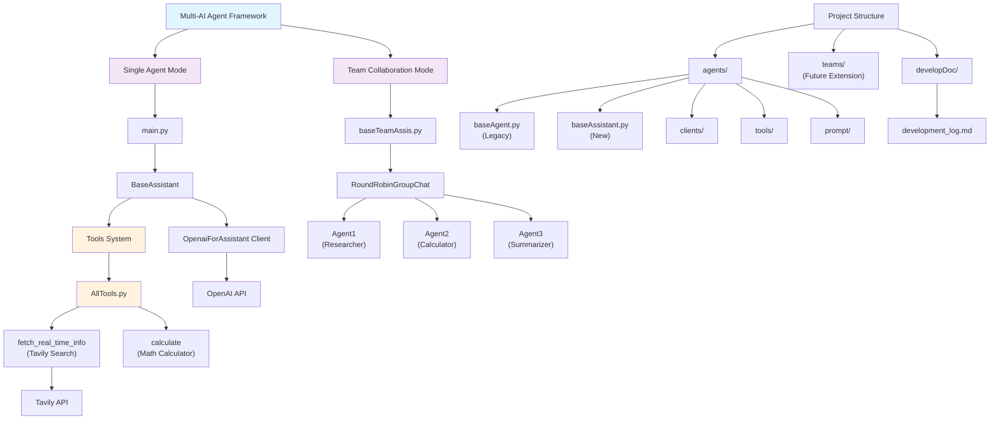

# Multi-AI Agent Framework

## 项目概述

Multi-AI是一个基于AutoGen框架构建的智能代理系统，旨在创建能够执行复杂任务的AI代理团队。该项目实现了单个智能代理和多代理团队协作两种模式，支持工具调用能力，可以通过ReAct (Reason and Act) 模式与外部工具交互，实现信息检索、数学计算等功能。

## 核心特性

### 🤖 智能代理系统
- 基于AutoGen Chat框架的异步代理实现
- **单代理模式**: BaseAssistant - 支持独立任务执行
- **多代理团队模式**: RoundRobinGroupChat - 支持团队协作
- 支持ReAct (Reason, Action, Observation) 推理模式
- 可扩展的工具调用架构

### 🔧 内置工具集
- **实时信息检索**: 集成Tavily搜索API，获取最新网络信息
- **数学计算器**: 支持复杂数学表达式计算
- **统一工具接口**: 通过FunctionTool统一管理工具调用
- **可扩展工具接口**: 轻松添加新的工具和功能

### 🌐 LLM集成
- OpenAI API集成，支持自定义模型和API端点
- 专用的OpenaiForAssistant客户端实现
- 异步调用机制，提高响应效率
- 可配置的模型参数和环境变量管理

### 👥 团队协作功能
- 多代理轮询对话机制
- 可配置的终止条件（最大消息数、文本提及等）
- 支持代理间工具共享和协作
- 流式对话界面支持

## 项目架构

```
backend/
├── main.py                    # 单代理模式主程序入口
├── baseTeamAssis.py          # 多代理团队模式入口
├── agents/                   # 代理模块
│   ├── baseAgent.py         # 基础代理类（原版）
│   ├── baseAssistant.py     # 助手代理类（新版）
│   ├── clients/             # LLM客户端
│   │   └── OpenaiForAss.py  # OpenAI助手客户端实现
│   ├── tools/               # 工具集
│   │   ├── AllTools.py      # 统一工具管理
│   │   ├── useTavilySearch.py  # 搜索工具
│   │   └── useCalculator.py    # 计算工具
│   └── pormpt/              # 提示词模板
│       └── basePrompt.py    # 基础提示词
├── teams/                   # 团队协作模块
├── developDoc/              # 开发文档目录
├── pyproject.toml           # 项目配置
└── README.md                # 项目文档
```

## 技术栈

- **Python 3.10+**: 主要编程语言
- **AutoGen AgentChat**: AI代理框架
- **AutoGen Core**: 核心工具和功能
- **OpenAI API**: 大语言模型服务
- **Tavily API**: 实时搜索服务
- **AsyncIO**: 异步编程支持
- **UV**: 现代Python包管理器

## 快速开始

### 环境要求
- Python 3.10+
- UV包管理器 (推荐) 或 pip

### 安装依赖

```bash
# 使用UV (推荐)
uv sync

# 或使用pip
pip install -r requirements.txt
```

### 环境配置

创建`.env`文件并配置以下环境变量：

```env
# OpenAI配置
OPENAI_API_KEY=your_openai_api_key
OPENAI_BASE_URL=https://api.openai.com/v1  # 可选，默认官方API
OPENAI_MODEL=gpt-3.5-turbo  # 可选，默认模型

# Tavily搜索API (可选)
TAVILY_API_KEY=your_tavily_api_key
```

### 运行示例

#### 单代理模式
```bash
python main.py
```

#### 多代理团队模式
```bash
python baseTeamAssis.py
```

## 使用示例

### 单代理模式示例
```python
import asyncio
from agents.baseAssistant import BaseAssistant
from autogen_agentchat.messages import TextMessage
from autogen_core import CancellationToken
from agents.clients.OpenaiForAss import OpenaiForAssistant

async def main():
    model_client = OpenaiForAssistant(api_key=api_key, base_url=base_url, model=model)
    agent = BaseAssistant(
        name="assistant", 
        model_client=model_client,
        handoffs=["user"],
        system_prompt=system_prompt
    )
    
    response = await agent.on_messages(
        messages=[TextMessage(content="计算 15 * 23 + 45", source="user")],
        cancellation_token=CancellationToken()
    )
    
    print("回答:", response.chat_message.content)

asyncio.run(main())
```

### 多代理团队协作示例
```python
from autogen_agentchat.teams import RoundRobinGroupChat
from autogen_agentchat.agents import AssistantAgent
from autogen_agentchat.conditions import MaxMessageTermination

# 创建多个代理
agent1 = AssistantAgent(name="researcher", model_client=model_client, tools=tools)
agent2 = AssistantAgent(name="calculator", model_client=model_client)
agent3 = AssistantAgent(name="summarizer", model_client=model_client)

# 创建团队
team = RoundRobinGroupChat(
    participants=[agent1, agent2, agent3], 
    termination_condition=MaxMessageTermination(max_messages=10)
)

# 执行任务
task = "世界上最长的河流是什么？计算它的长度和第二长的长度的差是多少？"
await Console(team.run_stream(task=task))
```

### ReAct推理示例
代理将自动识别需要使用的工具：

**用户输入**: "查找中国和美国的人口数据，并计算人口密度"
**代理推理过程**:
1. **Thought**: 我需要搜索中国和美国的人口和面积数据
2. **Action**: fetch_real_time_info: 中国人口2024
3. **Observation**: [搜索结果]
4. **Action**: calculate: 人口密度计算
5. **Answer**: 基于搜索和计算结果的综合回答

## 核心组件说明

### BaseAssistant (新版代理)
- 继承自AutoGen的`AssistantAgent`
- 支持工具调用和handoff机制
- 优化的异步消息处理
- 内置错误处理和超时机制

### BaseAgent (原版代理)
- 继承自AutoGen的`BaseChatAgent`
- 实现ReAct推理循环
- 支持多轮对话和工具调用
- 保持向后兼容性

### 工具系统
- **fetch_real_time_info**: 使用Tavily API进行实时网络搜索
- **calculate**: 安全的数学表达式计算器
- **FunctionTool集成**: 统一的工具调用接口
- 可通过`AllTools.py`轻松扩展新工具

### 团队协作系统
- **RoundRobinGroupChat**: 轮询式多代理对话
- **可配置终止条件**: 支持消息数量、文本提及等多种终止方式
- **流式界面**: 实时显示团队对话过程

### OpenAI客户端
- **OpenaiForAssistant**: 专为助手代理优化的客户端
- 支持异步调用和流式响应
- 可配置的API端点和模型参数
- 完整的错误处理机制

## 开发指南

### 添加新工具
1. 在`agents/tools/`目录下创建新的工具文件
2. 实现工具函数，接受字符串参数，返回字符串结果
3. 在`AllTools.py`中使用`FunctionTool`注册工具
4. 更新系统提示词以包含工具描述

### 自定义代理
```python
from agents.baseAssistant import BaseAssistant
from agents.tools.AllTools import tools

class CustomAgent(BaseAssistant):
    def __init__(self, name: str, model_client, **kwargs):
        super().__init__(name, model_client, **kwargs)
        # 可以在这里添加自定义配置
```

### 创建自定义团队
```python
from autogen_agentchat.teams import RoundRobinGroupChat
from autogen_agentchat.conditions import TextMentionTermination

# 自定义终止条件
termination = TextMentionTermination("TASK_COMPLETE")

# 创建专门的团队
research_team = RoundRobinGroupChat(
    participants=[researcher_agent, analyst_agent, writer_agent],
    termination_condition=termination
)
```

## 项目特色

### 复杂任务处理能力
项目支持处理复杂的多步骤任务，如：
- 数据搜索 + 计算 + 分析的组合任务
- 多国家/地区数据对比分析
- 实时信息检索与历史数据结合

### 灵活的部署模式
- **单代理模式**: 适合简单任务和快速响应
- **团队模式**: 适合复杂任务和专业化分工
- **混合模式**: 可根据任务复杂度动态选择

## 贡献指南

欢迎提交Issue和Pull Request来帮助改进项目！

### 开发环境设置
```bash
git clone [repository-url]
cd Multi-ai/backend
uv sync
```

### 代码规范
- 遵循PEP 8代码风格
- 为新功能添加文档字符串
- 编写单元测试（推荐）
- 使用Ruff进行代码格式化和检查

## 许可证

本项目采用 [LICENSE] 许可证。

## 更新日志

### v0.2.0 (当前版本)
- 新增多代理团队协作功能
- 实现BaseAssistant新版代理类
- 优化工具调用机制，使用FunctionTool统一管理
- 添加OpenaiForAssistant专用客户端
- 支持流式对话界面
- 完善项目结构和文档

### v0.1.0
- 初始版本发布
- 实现基础代理和工具调用系统
- 集成OpenAI和Tavily API
- 支持ReAct推理模式

---

**注意**: 请确保妥善保管您的API密钥，不要将其提交到版本控制系统中。建议使用`.env`文件管理环境变量，并将其添加到`.gitignore`中。
